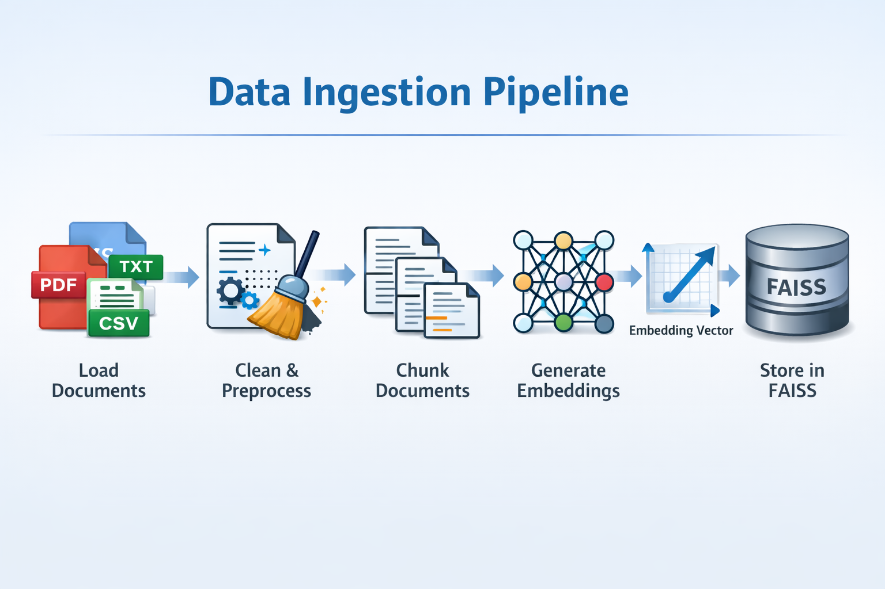

# 📌 Retrieval-Augmented Generation (RAG)

  

Retrieval-Augmented Generation (RAG) enhances Large Language Models (LLMs) by retrieving relevant external knowledge and injecting it into the prompt before generation. 

This approach improves factual accuracy, grounding, and significantly reduces hallucinations.

---

## 🔹 Architecture

This implementation currently covers data ingestion and vector indexing only.
The pipeline prepares documents for semantic search by converting them into dense vector embeddings stored in FAISS.

            ┌──────────────────────────┐
            │   Raw Documents (data/)  │
            │  PDF / TXT / CSV inputs  │
            └─────────────┬────────────┘
                          │
                          ▼
            ┌──────────────────────────┐
            │      data_ingestion.py   │
            │  load → clean → chunk    │
            │  embed documents         │
            └─────────────┬────────────┘
                          │ 
                          ▼
            ┌──────────────────────────┐
            │   FAISS Vector Store     │
            │  index dense embeddings  │
            └──────────────────────────┘
            
Components
	•	Raw Documents (data/)
	•	Source files used for knowledge ingestion (PDF, text, CSV).
	•	Data Ingestion (data_ingestion.py)
	•	Loads documents
	•	Cleans and preprocesses text
	•	Splits text into chunks
	•	Generates dense embeddings using Sentence-Transformers
	•	Vector Store (vector_store_faiss.py)
	•	Creates and manages FAISS index
	•	Stores dense vector representations
	•	Enables efficient similarity search (retrieval layer to be added later)
---

## 🔹 Ingestion

Raw data is processed, transformed, and stored to enable fast and accurate semantic search.

### Ingestion Pipeline
* Load documents (PDF / Text / CSV)
* Clean and preprocess text
* Chunk documents into semantically meaningful segments
* Generate dense vector embeddings
* Store embeddings in FAISS for efficient similarity search

---

## 🔹 Retrieval (Planned)

The retrieval stage will be added in the next phase of the project.

### Planned Retrieval Flow
* Convert user query into an embedding
* Perform similarity search using FAISS
* Retrieve Top-K most relevant document chunks
* Pass retrieved context to an LLM for grounded response generation

---

## 🔹 Tech Stack

### Embeddings
- Sentence-Transformers
  * BGE
  * E5
  * SBERT

### Vector Store
* FAISS (Facebook AI Similarity Search)

---

## 🔹 Core Files

- `data_ingestion.py`  
  Handles document loading, cleaning, chunking, and embedding generation

- `vector_store_faiss.py`  
  Manages FAISS indexing and similarity search

- `data/`  
  Contains raw input documents

- `requirements.txt`  
  Project dependencies

---
